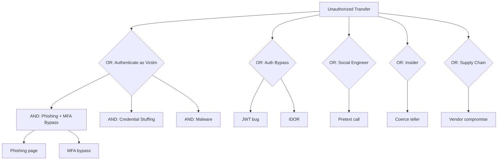

# Example Attack Tree: Transfer Money from Victim's Account

Illustrative attack tree for a banking web+mobile app. Used to demonstrate:
- Concrete root goal
- AND/OR decomposition
- Leaf annotation (P=probability, C=cost, S=skill, D=detectability)
- Identification of cheapest attacker path
- Mitigation targeting

## Root
**Transfer > $10,000 from victim's account to attacker-controlled account without victim consent**

## Tree (outline)

```
ROOT: Unauthorized transfer from victim account
├── OR-A: Authenticate as victim, then transfer
│   ├── AND-A1: Phishing + MFA bypass
│   │   ├── Harvest username/password via phishing site  [P=M, C=L, S=Novice, D=M]
│   │   └── Bypass MFA (one of):
│   │       ├── SIM swap for SMS OTP                     [P=M, C=M, S=Inter,  D=M]
│   │       ├── Phishing relay for TOTP                  [P=M, C=L, S=Inter,  D=M]
│   │       └── MFA-fatigue push-bombing                 [P=L, C=L, S=Novice, D=L]
│   ├── AND-A2: Credential stuffing
│   │   ├── Obtain breached creds for victim             [P=H, C=L, S=Novice, D=M]
│   │   └── Bypass rate-limit + MFA (as above)           [P=L, C=L, S=Inter,  D=H]
│   └── AND-A3: Malware on victim device
│       ├── Deliver infostealer                          [P=M, C=M, S=Inter,  D=M]
│       └── Steal session cookies / key material         [P=H, C=L, S=Novice, D=L]
├── OR-B: Bypass authentication (server side)
│   ├── Exploit auth vulnerability (JWT alg=none, etc.)  [P=L, C=L, S=Expert, D=L]
│   └── Exploit IDOR in transfer endpoint                [P=L, C=L, S=Inter,  D=M]
├── OR-C: Social engineer call centre
│   ├── AND-C1: Pretext call with stolen KYC data
│   │   ├── Obtain KYC data (breach aggregator)          [P=M, C=L, S=Novice, D=L]
│   │   └── Convince agent to transfer                   [P=M, C=L, S=Inter,  D=M]
├── OR-D: Insider (bank employee)
│   └── AND-D1: Compromise teller with transfer rights
│       ├── Recruit / coerce insider                     [P=L, C=H, S=Inter,  D=M]
│       └── Insider executes transfer                    [P=H, C=L, S=Novice, D=M]
└── OR-E: Supply chain
    └── AND-E1: Compromise bank software supply chain
        ├── Compromise vendor code sign key              [P=L, C=H, S=Expert, D=L]
        └── Push malicious update                        [P=M, C=M, S=Expert, D=H]
```

## Cheapest Path Analysis

Walking min-cost / max-probability from root:
- OR-A is cheapest family (L cost overall)
- Within OR-A, AND-A1 is cheapest (phishing kit cheap + SIM-swap ~$500)
- Within MFA-bypass alternatives, phishing-relay TOTP is cheapest and works on any TOTP MFA

**Attacker's rational path**: Phishing page + AiTM relay for TOTP → authenticate → initiate transfer.
**Estimated attacker cost**: ~$1-2k, intermediate skill, medium detectability.

## Mitigation Targeting

| Target leaf(s) | Control | Effect on cost/detect |
|----------------|---------|-----------------------|
| MFA bypass (all legs) | Replace TOTP/SMS with WebAuthn/passkeys (phishing-resistant) | Cost: raises H; removes A1 MFA-bypass branch entirely |
| Phishing page | Domain monitoring + brand detection + takedowns | Cost: raises M |
| SIM swap | Use non-SMS MFA; carrier SIM-lock services | Removes that branch |
| Cookie theft (A3) | Token binding / device-bound cookies (DBSC) | Raises skill to Expert |
| Transfer endpoint | Out-of-band transaction confirmation for > $X | Adds AND requirement on all OR-A branches |
| Call centre (C) | Require biometric verification / callback to registered number | Raises C to H |
| Insider (D) | Four-eyes approval on large transfers + continuous UEBA | Raises detectability to H |
| Supply chain (E) | SLSA L3 builds, sigstore attestation, staged rollout | Raises cost H |

## Post-mitigation Cheapest Path

After WebAuthn + out-of-band transfer confirmation:
- OR-A becomes expensive (phishing-resistant MFA)
- OR-C (call centre) and OR-D (insider) become comparatively cheaper
- Defender focus shifts to call-centre and insider controls

## Key Lessons

1. **One control often breaks multiple legs** — WebAuthn neutralizes four phishing variants at once.
2. **Transfer-time confirmation is an AND inserted below the root** — raises cost on every auth-based branch.
3. **Supply chain and insider** dominate once technical controls are strong; plan for them.
4. **Detectability matters**: a path with detectability H is deterred even if cheap.

## Mermaid Rendering


