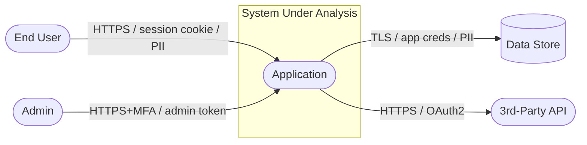
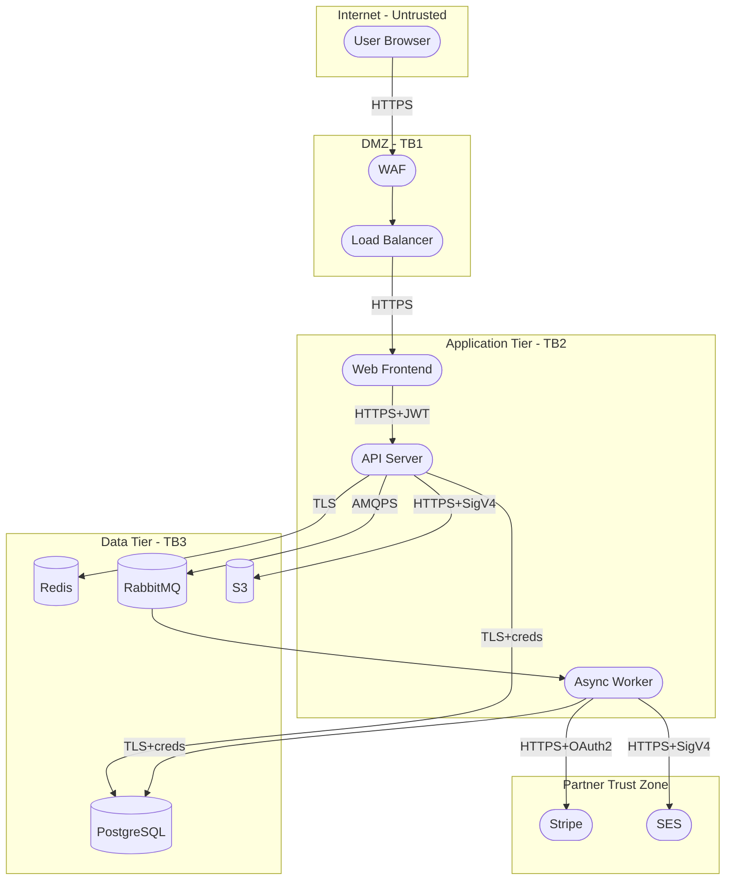
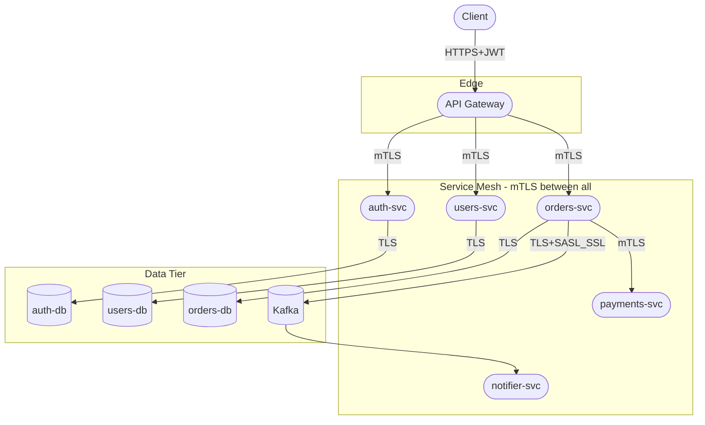
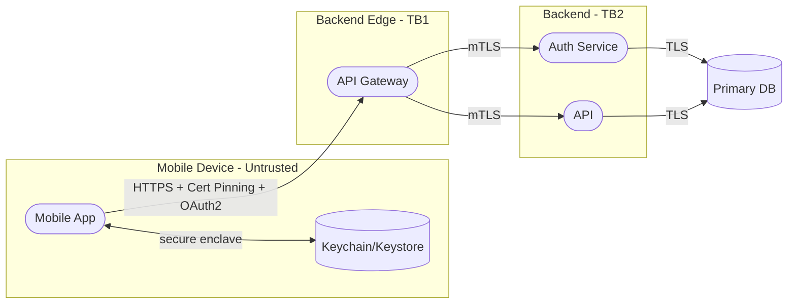
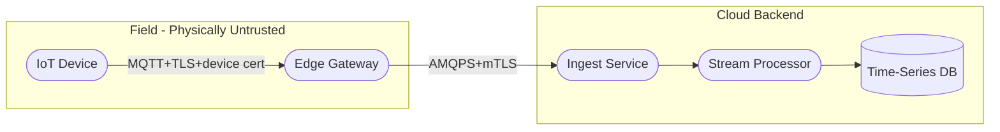
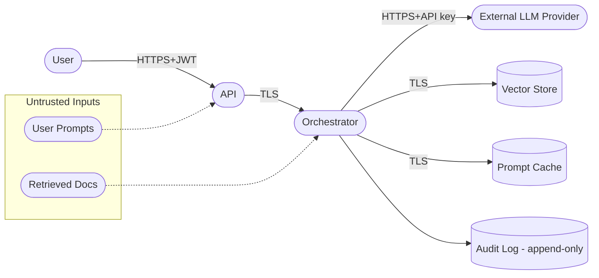
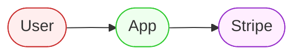

# Mermaid DFD Templates

Ready-to-adapt Mermaid templates for DFDs with trust boundaries. Frontier models render these inline in most chat surfaces.

## Template 1: Level-0 Context Diagram

## Template 2: Classic 3-Tier Web App (Level-1)

## Template 3: Microservices with Service Mesh

## Template 4: Mobile App + Backend

## Template 5: IoT / Edge

## Template 6: AI/ML Inference Pipeline

## Styling Tips

Add colour to highlight trust zones:

## Conventions in These Templates

- **Rectangles** = external entities (`User`, `Admin`)
- **Rounded rectangles / stadiums** (`([Name])`) = processes
- **Cylinders** (`[(Name)]`) = data stores
- **Subgraphs** = trust boundaries — name them `"<Zone Name> - TB<N>"`
- **Edge labels** = `protocol / auth / data classification`
