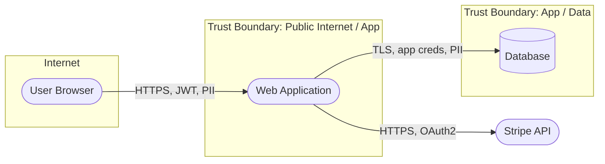
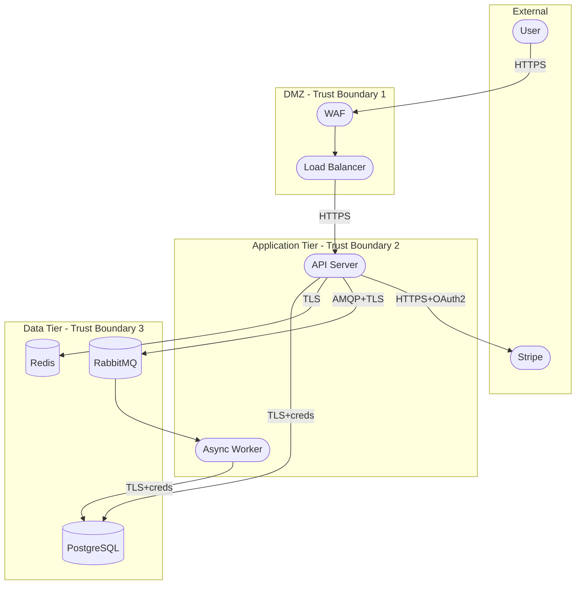

# Workflow: DFD Creation (with Mermaid)

Produce a Level-0 and Level-1 Data Flow Diagram as Mermaid source. Frontier models render Mermaid inline in most chat surfaces; use it as the default DFD format.

## Inputs
- Architecture docs, repo tree, OpenAPI specs, infra-as-code (Terraform/CloudFormation), or a user description.
- Optionally: an architecture diagram image (frontier multimodal models can parse them).

## Outputs
- Level-0 (context) DFD
- Level-1 (decomposed) DFD
- Trust boundary annotations
- Asset & data-classification table

## Steps

### 1. Identify elements
Enumerate:
- **External entities** (users, 3rd-party APIs, services outside scope) — rectangles
- **Processes** (services, functions, containers) — circles / rounded rectangles
- **Data stores** (DBs, queues, caches, object storage, file systems) — parallel lines / cylinders
- **Data flows** (every request/response pair) — arrows, labelled with protocol + data type
- **Trust boundaries** (network, privilege, tenant, regulatory) — dashed regions

### 2. Start with Level-0 (Context Diagram)
Show the system as a single process, surrounded by external entities. One Mermaid block.

### 3. Decompose to Level-1
Break the single process into its major components. One diagram per major subsystem. Stop decomposing when: all flows are attributable to a single technology/service, and trust boundaries are clear.

### 4. Annotate flows
Each data flow must record:
- Protocol (HTTPS, gRPC, AMQP, JDBC, ...)
- Authentication (mTLS, JWT, API key, none)
- Data classification (public, internal, confidential, restricted, PII)
- Direction (one-way / request-response)

### 5. Mark trust boundaries
See `references/trust_boundary_patterns.md` for common patterns (internet/DMZ, DMZ/internal, tenant isolation, control/data plane).

## Mermaid Template (Level-0)

## Mermaid Template (Level-1 with boundaries)

## Tips for Frontier Models

- Prefer `flowchart` over `graph` — newer syntax, better renderers.
- Use `subgraph` for trust boundaries; name them `"Trust Boundary: ..."` for clarity.
- Label every edge with `protocol | auth | data class`.
- For image-input (architecture screenshots): identify text labels, redraw as Mermaid rather than transcribing — catches ambiguities.

## Alternative Formats

| Format | When |
|--------|------|
| Mermaid | Default — inline rendering everywhere |
| PlantUML | Complex diagrams, deployment views (`@startuml`) |
| Graphviz DOT | Attack trees, auto-layout heavy graphs |
| draw.io / diagrams.net | Human-edited iteration |
| Microsoft Threat Modeling Tool | Windows-native workflow |
| OWASP Threat Dragon | STRIDE auto-suggestion + DFD |

See also `examples/mermaid_dfd_templates.md` for ready-to-copy templates.
